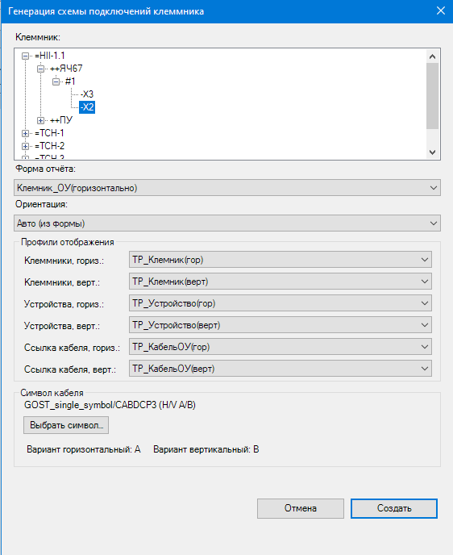
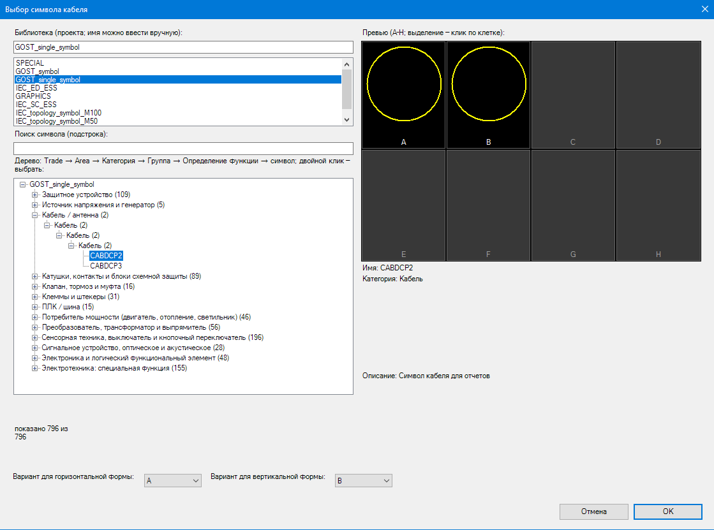

# TerminalStripAddin — генератор схемы подключения клеммника (EPLAN Electric P8 2.9)

Аддин для **EPLAN Electric P8 2.9.4**, который по выбранному клеммнику автоматически
достраивает на странице схему подключения: линии от клемм к кабелям и назначениям,
символы кабелей, шины кабелей с двух сторон клеммника, линии-ссылки со стрелкой и
точки разрыва с обозначением противоположного конца кабеля.

Электрику аддин **не выдумывает**: клеммы, соединения и кабели читаются из
EPLAN Data Model, а визуальное расположение задаёт **форма отчёта `.f11`**,
которую вы готовите сами.

▶ **Демонстрация работы аддина (видео):**
https://www.youtube.com/watch?v=f3X_mz8LoGU

---

## 1. Как вызывается

Команда: **`TERMINAL_STRIP_ANALYZE`** — имя объявляет реализация `IEplAction.OnRegister`
(`addin/Actions/AnalyzeAction.cs:2888`); точкой загрузки DLL служит класс
`TerminalStripAddIn` (`addin/AddIn.cs`, `IEplAddIn`, загружается при старте EPLAN).

Способы запуска:

* командная строка EPLAN → ввести `TERMINAL_STRIP_ANALYZE` и нажать Enter;
* кнопка на ленте/панели, которой назначена эта команда.

Условия запуска (проверяются, при нарушении — понятное сообщение, ничего не создаётся):

| Требование | Комментарий |
|---|---|
| Открыт проект EPLAN | без проекта — выход с сообщением |
| Активна страница типа **«Однополюсная схема соединения»** (`CircuitSingleLine`) | аддин не переключает страницы за вас |
| В проекте есть клеммники | иначе диалог выбора пуст |
| В каталоге форм есть `*.f11` | список берётся из активной схемы настроек (Опции → Настройки → Пользователь → Управление → Каталоги) |

---

## 2. Как работает

1. **Проверки окружения** — проект, активная страница и её тип.
2. **Сбор данных для диалога** — дерево клеммников проекта (промежуточные узлы =
   структура ОУ, листья = полные ОУ), список форм `*.f11`, каталог наборов
   отображения `point/*.emc`.
3. **Диалог «Генерация схемы подключений клеммника»** — что выбираете:
   * клеммник (дерево);
   * форма отчёта (`ComboBox` из всех `*.f11`);
   * ориентация: **Авто** (определяется по структуре формы, см. 3.3) / Горизонтальная / Вертикальная;
   * символ кабеля: кнопка «Выбрать символ…» — библиотека, символ, вариант для
     горизонтального и вертикального отчёта;
   * 6 профилей отображения (необязательно): стенд / устройство / связь ×
     горизонтальный / вертикальный.
4. **Клик по странице** — точка вставки отчёта. Под курсором рисуется рамка-призрак,
   размер которой считается из метрик шапки/колонок/футера формы и разноса шин кабелей
   (зазоры и шаги выводятся из реального размера выбранного символа). **Esc** — отмена,
   ничего не создаётся.
5. **Создание встроенного отчёта** штатными средствами EPLAN (`CreateEmbeddedReport`):
   форма добавляется в проект, тип отчёта перебирается по приоритету —
   `TerminalConnectiondiagram` → `InterconnectDiagram` → `TerminalLineupDiagram` →
   `TerminalStripOverview`, затем все остальные типы, в имени которых есть
   `Terminal` или `Interconnect` (кроме `TerminalDiagram`); схема фильтра — пусто /
   `Structured terminals` / `Структурированные клеммы`.
6. **Чтение электрики из Data Model** выбранного клеммника:
   `TerminalStrip → Terminal → ExternalConnections/ConnectionInfo → Connection → Cable`.
   Единица анализа — конкретное `Connection`, поэтому корректно обрабатываются
   несколько соединений на клемму, подключения с разных сторон, мосты и
   один кабель, подключённый с обеих сторон.
7. **Сопоставление графики отчёта с клеммами** (детектор К1–К4 + якоря): точки
   подключения берутся из геометрии выводов, а «номер клеммы» — из дескрипторов
   формы. Никаких фиксированных смещений и шагов строк.
8. **Геометрия кабелей** — группировка соединений по кабелям (в т.ч. один кабель с
   двух сторон), расчёт шин, подходов, колонок символов и уровней.
9. **Создание объектов** на странице:
   * графические линии от клемм/мостов к каблям и назначениям (слой `EPLAN100`,
     красное перо, ширина 0.35 мм); для соединений без кабеля — просто линия;
   * **символ кабеля** на каждом кабеле;
   * **линия-ссылка** от символа кабеля наружу, со стрелкой;
   * **точка разрыва** (`BPIN`) на конце линии-ссылки — с ОУ обратного конца;
   * для кабеля между двумя клеммниками — шинный вариант точки разрыва в шапке;
   * если профиль `.emc` выбран — набор отображения применяется к вставленному символу.
10. **Лог и итоговое окно**: в окне — только ошибки, подробности в лог-файле.

### 2.1 Диалог генерации

Главное окно аддина — «Генерация схемы подключений клеммника»:



| Элемент | Что это | На что обратить внимание |
|---|---|---|
| **Клеммник:** дерево | структура ОУ: `=установка` → `++место сборки` → `+место установки` → `#пользовательская структура`; листья — сами клеммники (`-X1`, `-X2`…) | выбираются **только листья** (промежуточные узлы выбрать нельзя); последний выбор запоминается и подставляется при следующем прогоне |
| **Форма отчёта:** список | все `*.f11` проекта и системы, без расширения | выберите свою форму (см. 3.3); при смене формы проверьте ориентацию |
| **Ориентация:** список | `Авто (из формы)` / `Горизонтальная` / `Вертикальная` | `Авто` определяет ориентацию по структуре отчёта; при сомнениях задайте явно |
| **Профили отображения** (группа) | 6 списков наборов `.emc`: клеммники / устройства / ссылка кабеля × горизонт. / верт. | в списках только схемы, совместимые с вариантом точки разрыва; если папка `point/` пуста — списки пустые и выключены (точки разрыва будут с дефолтным отображением) |
| **Символ кабеля** (группа) | строка вида `библиотека/символ (H/V A/B)`, кнопка **Выбрать символ…**, подписи вариантов под горизонтальную и вертикальную форму | варианты можно задать разными для горизонтального и вертикального отчёта |
| **Создать** / **Отмена** | «Создать» (Enter) — запускает выбор точки вставки и генерацию; «Отмена» — выход без единого созданного объекта | с пустым выбором «Создать» не закрывает окно |

После «Создать» аддин просит **кликнуть точку на странице** — это место вставки отчёта;
`Esc` отменяет выбор и ничего не создаёт (см. 2, шаг 4).

### 2.2 Браузер символа кабеля

Окно «Выбор символа кабеля» (открывается кнопкой «Выбрать символ…»):



| Элемент | Что это |
|---|---|
| **Библиотека (проекта; имя можно ввести вручную):** поле + список | библиотеки символов проекта и системы (`SPECIAL`, `GOST_single_symbol`, `GRAPHICS`, IEC-наборы и т. д.); имя можно вписать вручную, если библиотека не выведена в список |
| **Поиск символа (подстрока):** | фильтр по названию символа |
| **Дерево:** `Trade → Area → Категория → Группа → Определение функции → символ` | символы сгруппированы по дереву определений функций; счётчик внизу — «показано N из 796» |
| **Превью (A–H; выделение — клик по клетке):** | варианты символа буквами A–H; клик по клетке выбирает вариант для листа |
| **Имя / Категория / Описание** | карточка выбранного символа (например `CABDCP2`, категория «Кабель», описание «Символ кабеля для отчетов») |
| **Вариант для горизонтальной формы:** / **Вариант для вертикальной формы:** | два слота: какой вариант (A–H) вставлять в горизонтальном и в вертикальном отчёте |
| **ОК** / **Отмена** | применить выбор к диалогу генерации |

Скриншоты сделаны на стенде заказчика, поэтому имена на них (`Клемник_ОУ(горизонтально)`,
`GOST_single_symbol/CABDCP3`, `ТР_Клемник(гор)` и т. п.) — это конкретные значения его
проекта; в коде значения по умолчанию другие (см. 3.2 и 3.5).

---

## 3. Что нужно подготовить в EPLAN заранее

### 3.1. Клеммник и данные

* Клеммник должен существовать в проекте и иметь **реальные соединения** в Data Model
  (однополюсные страницы с клеммниками + страницы с потребителями/кабелями).
* Для корректной **точки разрыва** у кабеля должны быть заполнены свойства соединений
  жил (№31019/31020); fallback — свойства кабеля «Кабели: источник» (№20376) /
  «Кабели: цель» (№20377). По ним аддин определяет противоположный конец.

### 3.2. Свой символ кабеля (обязательно)

Аддин **не рисует кружок кабеля от руки** — он вставляет настоящий символ из
библиотеки символов. Заведите свой символ кабеля в библиотеке символов (проектной
или системной; для однополюсных схем — символ с видом представления «однополюсный»).

Что важно:

| Требование | Почему |
|---|---|
| В библиотеке есть библиотечный символ (`.slk`/`.esl`) и вариант(ы) | аддин вставляет `SymbolVariant` выбранного варианта; если вариант недоступен — в логе `[SYMBOL] вариант '…' недоступен` и символы не создаются |
| У символа есть **главная функция** (символ вставляется как `Function`) | аддин ставит главную функцию «выкл.» (свойство 20122) и вид представления «однополюсный» (20121) — иначе отказы `[SYMFUNC]` |
| Символ различим по размеру: размеры **не хардкодятся** — замеряются `GetBoundingBox()`; из них считаются зазоры и шаги | фолбэк габарита, если замер не удался, — 14 мм |
| Выбранный вариант должен подходить под ориентацию (H/V) | в настройках два слота вариантов — по одному на ориентацию |

Как выбрать: в диалоге кнопка «Выбрать символ…» (дерево библиотек → символы →
вариант). Выбор сохраняется в настройки (`SymbolLibrary`, `SymbolName`, `VariantH`, `VariantV`).

Значения по умолчанию (в коде как эталон): библиотека `SPECIAL`, символ `CABDCP2`,
вариант `0` («A»). Это **системный** символ — он годится не всем проектам, поэтому
рекомендуется заменить его своим.

Аддин записывает в символ кабеля ОУ по **полному ОУ самого кабеля** (из Data Model):
структурные блоки `1100` установка, `1400` место сборки, `1200` место установки,
`1600` пользовательская структура (каждый — по сегментам, точка в значении = подчинённый
идентификатор) плюс `20013` код и `20014` номер. Запись идёт **явно**, через
`FunctionBase.NameParts` и `NameService` (структуру от страницы отчёта брать нельзя —
на отчётной странице она другая). Отказы — WARN `[SYMDT]`, остальные символы создаются.

Текст обозначения кабеля рисует **сама форма отчёта** — аддин второй раз его не дублирует.

### 3.3. Форма отчёта `.f11` (обязательно)

> **Готовые примеры форм лежат в папке `example/` репозитория:**
> `Клемник_ОУ(горизонтально)_addin.f11` и `Клемник_ОУ(вертикально)_addin.f11` —
> это рабочие мастер-данные EPLAN 2.9 (`Type="Form"`). Их можно импортировать в
> проект как готовую основу (Файл → Импорт → мастер-данные) и править под свой
> клеммник, вместо того чтобы собирать форму с нуля.

Форма — это «чертёж», который EPLAN разворачивает в отчёт; аддин читает её геометрию
и дорисовывает поверх кабельную часть. Требования:

| Что должно быть в форме | Зачем аддину |
|---|---|
| Поля/дескрипторы **с номерами клемм** в одном доминирующем ряду (горизонтальная форма) или столбце (вертикальная) — минимум 2 числовых дескриптора | это якоря: «номер клеммы ↔ позиция колонки». Нет ряда номеров — нет сопоставления (WARN в логе) |
| **Линии выводов** на слое выводов: связные цепочки с ровно двумя концами (внутренние вершины степени 2); неколлинеарная цепочка = перемычка | из них берутся точки подключения клеммы |
| **Короткие ступы-маркеры** (длина ≤ 1 мм) на слое маркеров, по одному на колонку клеммы | центр ступа = колонка клеммы, к которой привязываются точки |
| Штатные обозначения клемм/кабелей — остаются на слоях EPLAN | аддин их не меняет и не дублирует |
| Имя формы **желательно с подстрокой `addin`** (например `Клемник_ОУ(горизонтально)_addin`) | фильтр «своих» форм в headless-режиме |

Практика по слоям: при вставке отчёта EPLAN сливает таблицы слоёв формы и страницы и
переименовывает автослои `EPLANnnn`, поэтому фактические имена слоёв (сейчас
выводы — `EPLAN450`, маркеры — `EPLAN100`) заданы в `AddInConfiguration`. Если форма
переносится в другой проект, разумно завести **собственные уникальные имена слоёв**
и поправить конфиг — тогда автонумерация EPLAN не сможет их переименовать.

Ориентация не зашита: она определяется в таком порядке.

1. **Явный выбор в диалоге** — Горизонтальная или Вертикальная (`[ORIENT] manual`).
2. **Авто** (по умолчанию) — **геометрически по структуре отчёта**:
   `AnchorResolver.DetectOrientation` сравнивает раскладку числовых дескрипторов
   номеров — доминирующий **ряд по Y** против **столбца по X** (бакет 0.1 мм,
   порог ≥2 дескрипторов); вердикт и основание пишутся в лог:
   `[ORIENT-AUTO] Horizontal — evidence …`.
3. **Fallback Auto** — по пропорциям габарита всей графики отчёта:
   `[ORIENT-AUTO] … — fallback bbox W×H мм`.
4. Если и это не определил — значение из конфигурации `AddInConfiguration.Orientation`
   + WARN `[ORIENT-AUTO] не уверен — конфиг`.
5. Отдельно от пайплайна имя формы участвует в ориентации **рамки-призрака**
   (`GhostFrameMath.ResolveOrientation`: подсказки «вертикально»/`vertical` против
   «горизонтально»/`horizontal`, дефолт — горизонтальная). Поэтому называть форму
   «Клемник_ОУ(вертикально)_addin» полезно, но не обязательно.

### 3.4. Точка разрыва (спецсимвол) — создавать не нужно

В качестве точки разрыва используется **системный** символ
**библиотека `SPECIAL`, символ `BPIN` (категория 48 / `BPIN`)**. Он есть в любой
установке EPLAN, подготавливать его не нужно. Аддин подставляет вариант по типу
кабеля и ориентации отчёта:

| Случай | Вариант символа |
|---|---|
| прямой кабель, горизонтальный отчёт | `A` = 0 |
| прямой кабель, вертикальный отчёт | `D` = 3 |
| кабель между двумя клеммниками (шинный/«мульти»), горизонтальный отчёт | `E` = 4 |
| кабель между двумя клеммниками, вертикальный отчёт | `B` = 1 |

Обозначение точки разрыва аддин формирует сам и записывает явно (структуру от страницы
отчёта брать нельзя — на отчётной странице она другая):

* **прямой** кабель — структура обратного конца + код кабеля + суффикс `(EXT)`
  (у точки разрыва на устройстве — обозначение устройства как есть);
* **кабель между двумя клеммниками** (шинный вариант в шапке) — полное ОУ самого кабеля
  без суффикса;
* видимое имя приводится к норме (`NameService.AdjustVisibleName`).

Кросс-ссылка на противоположный конец в символ **не пишется** — она берётся из набора
отображения (см. 3.5).

### 3.5. Профили отображения `.emc` — необязательно, но нужно для обозначения и ссылки

Если нужно, чтобы точка разрыва показывала **обозначение** и **кросс-ссылку** на
противоположный конец кабеля, заведите свои наборы отображения свойств (`.emc`) и
положите их в папку `point/` рядом с DLL аддина. В диалоге они попадут в 6 списков
(«Профили отображения»): стенд/устройство/связь × горизонтальный/вертикальный.

Что аддин требует от файла `.emc`:

* корень набора — тег `<O155 …>` **с атрибутом `A2453`** = номер варианта символа
  (`0`/`3`/`4`/`1`, см. 3.4) и **атрибутом `A2454`** = имя схемы (оно показывается в
  списке профилей и по нему же активируется);
* один файл может содержать несколько схем; в одном файле допустимы несколько
  `<O155>`;
* имя файла ≠ имя схемы — не путать;
* набор применяется к вставленному символу: `Import(путь, overwrite: true)` на каждый
  BP + активация схемы по имени. Импорт набора **чужого варианта** — тихий no-op, поэтому
  соответствие `A2453` варианту обязательно;
* содержимое схемы (какие свойства/тексты выводить — ОУ, кросс-ссылка и т. п.)
  проектируете вы в EPLAN; аддин ничего в файл не пишет и подмену свойств не делает.

Без выбранного профиля (или без папки `point/`) точки разрыва вставляются **с
дефолтным отображением** — это штатная деградация, не ошибка.

В репозитории лежат 4 готовых набора как образец формата: `point/ТР_Кабель_ext(гор).emc`,
`point/ТР_Кабель_ext(верт).emc`, `point/ТР_Кабель_int(гор).emc`,
`point/ТР_Кабель_int(верт).emc`.

Папка `point/` ищется в таком порядке: каталог загруженной сборки
(`Assembly.Location` — указывает на теневую копию EPLAN и обычно пуст) → `CodeBase`
реальной сборки → каталоги лога/настроек, где первый — «Сценарии» из настроек EPLAN.
Кладите `point/` рядом с **настоящей** DLL или в `<Сценарии>\terminal_strip_addin\point\`.

---

## 4. Сборка DLL

Сборка возможна только на Windows-машине с установленным EPLAN 2.9.4
(нужны EPLAN-DLL для компиляции).

```bat
cd addin
build_addin.bat
```

Скрипт (`addin/build_addin.bat`):

* компилятор — `C:\Windows\Microsoft.NET\Framework64\v4.0.30319\csc.exe`
  (.NET Framework 4.x). Старый компилятор не понимает интерполированные строки `$"…"`,
  null-conditional `?.`, `nameof`, `out var` — код написан как **C# 5**; по соглашению
  проекта здесь же не используются LINQ и авто-свойства;
* путь к EPLAN правится в первой строке: `set EPLAN_BIN=C:\Program Files\EPLAN\Platform\2.9.4\Bin`;
* ссылки: `Eplan.EplApi.AFu.dll`, `Eplan.EplApi.Baseu.dll`,
  `Eplan.EplApi.DataModelu.dll`, `Eplan.EplApi.HEServicesu.dll`,
  `Eplan.EplApi.MasterDatau.dll`, `Eplan.EplApi.EServicesu.dll`,
  `System.Windows.Forms.dll`, `System.Drawing.dll`;
* `/recurse:*.cs` — новые подкаталоги подхватываются сами, править скрипт не нужно;
* результат — **`addin\TerminalStripAddin.dll`**.

Порядок ключа `/out` и `/target` менять нельзя (`CS2022`).

Признак успешной сборки — окно компилятора **без ошибок**; предупреждения допустимы.
Два файла (`AnalyzeAction.cs`, `SymbolBrowserDialog.cs`) не компилируются вне
EPLAN-окружения (нужны EPLAN-DLL и WinForms), поэтому проверять правки в них
приходится отдельным пробным классом.

Правка кода логики = новая ревизия `BUILD_STAMP` в `addin/Actions/AnalyzeAction.cs`
(строка ~71) — так по логу видно, какая сборка отработала. **В строковом литерале
`BUILD_STAMP` используйте только «ёлочки»**, сырые `"` ломают компиляцию.

---

## 5. Установка и загрузка в EPLAN

1. Скопировать `TerminalStripAddin.dll` в **папку Сценарии EPLAN**
   («Параметры → Настройки → Пользователь → Управление → Папки → Addins»).
2. Положить рядом с DLL папку `point/` с наборами `.emc` (если они нужны).
3. **Перезапустить EPLAN** — DLL подхватывается из теневой копии (ShadowCopy),
   без перезапуска может исполняться старая сборка.
4. Открыть проект, сделать активной страницу типа «Однополюсная схема соединения».
5. Выполнить команду `TERMINAL_STRIP_ANALYZE`.
6. Проверить в логе строку `[INFO] BUILD_STAMP: …` — если версия старая, значит
   исполняется копия из ShadowCopy: перезапустить EPLAN.

Файлы, которые аддин создаёт/читает на машине:

| Файл | Путь |
|---|---|
| Лог | `<Сценарии>\terminal_strip_addin\terminal_strip_addin.log` |
| Настройки | там же — `terminal_strip_addin.settings` |
| Наборы `.emc` (необязательно) | `<Сценарии>\terminal_strip_addin\point\*.emc` либо папка `point/` рядом с DLL |

`<Сценарии>` — папка «Сценарии» из настроек EPLAN; аддин читает её через API
(`ProjectManager.Paths.Scripts`, справка 2.9: «default Scripts directory»), поэтому
переносить аддин на другую машину не требуется — путь подхватится, а подпапка
`terminal_strip_addin` внутри неё создастся сама при первом прогоне. Если настройки
EPLAN недоступны, лог и настройки пишутся в `%TEMP%`. Фактический путь всегда
печатается в шапке лога («Каталог лога: …») и в финальном окне («Лог: …») — если у вас
папка «Сценарии» настроена не там, где ожидалось, вы это сразу увидите в логе.

---

## 6. Настройки

Файл `terminal_strip_addin.settings` (в папке лога) — формат `key=value`,
`#` — комментарий, разбор по **первому** `=` (значения не обрезаются: хвостовой
пробел в имени формы значим). Ключи:

| Ключ | Смысл |
|---|---|
| `TargetStrip=` | полное имя клеммника (с ведущим `=`) |
| `Form=` | имя формы отчёта (без `.f11`) |
| `SymbolLibrary=`, `SymbolName=` | библиотека и имя символа кабеля |
| `VariantH=`, `VariantV=` | индексы вариантов символа (0-based) для горизонтального/вертикального отчёта |
| `OrientationMode=` | `Auto` / `Horizontal` / `Vertical` |
| `LogMode=` | `off` (обычный: ошибки и предупреждения) / `on` (полный лог); `debug` принимается как устаревший синоним `on`, в файл пишется канонично `on`/`off` |
| `EmcStripH=`, `EmcStripV=` | профиль `.emc` для точки разрыва на клеммнике |
| `EmcDeviceH=`, `EmcDeviceV=` | профиль для точки разрыва на кабельном устройстве |
| `EmcLinkH=`, `EmcLinkV=` | профиль для кабельного соединения (между клеммниками) |
| `GridPitch.<имя формы>=` | кэш шага сетки формы (заполняется автоматически) |

Значения профилей — сериализация выбранных пары «файл `.emc`|имя схемы»
(`EmcProfileCatalog.EncodeSelection`). Пустое значение = профиль не выбран.
Файл переписывается при каждом прогоне по результатам диалога.

---

## 7. Лог и диагностика

Теги, на которые стоит смотреть первыми делом:

| Тег | Что означает |
|---|---|
| `BUILD_STAMP` | какая сборка отработала (сверить с ожидаемой ревизией) |
| `[SETTINGS]` | путь к файлу настроек (или «файла нет — дефолты») |
| `[TREE]`, `[DM]`, `[MATCH]`, `[STRIPTREE]` | дерево отчёта, чтение Data Model, сопоставление клемм |
| `[ANCHOR]` | доминирующий ряд/столбец номеров и якоря |
| `[COMP]`, `[K4]`, `[SPLIT]` | детектор выводов К1–К4 |
| `[GEOM]`, `[CABLE]` | геометрия шин и группировка по каблям |
| `[SYMBOL]`, `[SYMFUNC]`, `[SYMDT]`, `[SYMSIZE]` | вставка символов кабеля, главная функция/вид представления, ОУ, замеры |
| `[BP-SUM]`, `[BP-ERR]`, `[BP-EMC]` | точки разрыва: сколько создано, отказы, импорт набора отображения |

Типичные **предупреждения, не являющиеся дефектом аддина**:

* `[K4] точка не привязалась к колонке` и `[MATCH] колонок … != клемм …` — особенности
  геометрии формы/данных проекта (например, EPLAN рисует лишнюю колонку под вторым
  выводом с одной стороны). Аддин такие слоты закрывает якорями (`[TCM-SUM] без
  сопоставления 0`); перерисовка формы — рекомендация, а не обязательный шаг.

Итоговое окно показывает **только ошибки**; полная картина — в логе.
`LogMode=on` в настройках включает подробный лог.

Если команда «молчит»: проверить папку Addins, перезапустить EPLAN, сверить
`BUILD_STAMP`.

---

## 8. Известные ограничения

* **Повторный прогон на ту же область не идемпотентен** — линии, символы кабеля и точки
  разрыва дублируются. Перед повтором удалите созданную графику (или работайте на
  чистой странице).
* Сборка и запуск — только Windows + EPLAN Electric P8 2.9.4.
* Рамка-призрак растёт **вниз от клика** (курсор = левый верхний угол): если графика
  легла выше клика, рамка её не покроет — это только подсказка, реальное положение
  задаёт точка вставки.
* Слои формы (`EPLANnnn`) при переносе в другой проект могут переехать — см. 3.3.

---

## 9. Структура репозитория

```text
addin/
├── AddIn.cs                            # IEplAddIn — точка загрузки аддина
├── Actions/AnalyzeAction.cs            # команда TERMINAL_STRIP_ANALYZE, весь конвейер
├── Configuration/AddInConfiguration.cs # слои, пороги, форма, тип отчёта, символы по умолчанию
├── UI/                                 # диалог, браузер символов, настройки (key=value)
├── Interaction/                        # выбор точки вставки кликом по странице
├── Report/                             # встроенный отчёт: форма → блоки → дерево → слои
├── Data/                               # чтение Data Model, модели, каталог .emc
├── Anchor/                             # якоря: номер клеммы ↔ колонка
├── Geometry/                           # чистая геометрия: детектор выводов К1–К4, призрак, шины
├── Graphics/                           # линии, символы кабеля, точки разрыва, стрелки, призрак
├── Diagnostics/                        # логгер, BUILD_STAMP
└── build_addin.bat                     # сборка DLL (csc, .NET 4, C# 5)
point/                                  # наборы отображения *.emc (необязательно)
example/                                # примеры форм отчёта *.f11 (горизонтальная и вертикальная)
img/                                    # скриншоты интерфейса (диалог генерации, браузер символа)
```